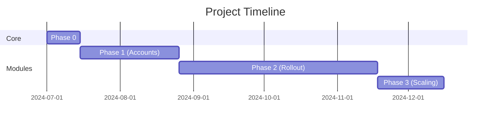

# Pharma ERP Development Plan

## Objective:

Develop and install a customized software solution for a pharmaceutical production business, covering Accounts, Inventory, HR, and Tax Management to streamline operations, ensure compliance, and enhance efficiency.

## Scope:

### Accounts Department:

[ ] Vouchers, Ledger, Financial Reporting, Tax Management

### Inventory & Cost Management:

[ ] Stock tracking, Batch-wise costing

### HR & Payroll:

[ ] Employee database, Payroll, Leave, Loans, Compliance

### Installation & Training:

[ ] Deployment, user training, and support

## Project Overview

**Objective:** Develop customized software for pharmaceutical production covering:

-   Accounts | Inventory | HR | Tax Management  
    **Goal:** Streamline operations, ensure compliance, enhance efficiency.

---

## Phase 0: Foundation Setup (2 Weeks)

**Core Infrastructure**

-   [ ] Server/Cloud Setup
-   [/] Database Design (MySQL)
-   [x] Basic Auth System (Laravel Sanctum)

**HR Core (Minimal)**

-   [/] Employee DB Schema
-   [/] Role Definitions (Admin, Accountant, Auditor)
-   [ ] Draft Approval Workflows

---

## Phase 1: Accounts + HR Lite (6 Weeks)

### Accounts Module

-   [ ] Voucher System (Sales/Purchase)
-   [/] Ledger Management
-   [/] Trial Balance Report

### HR Lite

-   [ ] Role-Based Access (RBAC)
-   [ ] Leave/Attendance Tracking
-   [ ] Voucher Approval Chains

**Deployment:** Pilot with Finance + HR Teams

---

## Phase 2: Incremental Rollout (12 Weeks)

| Module          | Depends On  | Key Features                  | Status |
| --------------- | ----------- | ----------------------------- | ------ |
| **Payroll**     | HR Core     | Salary, Loans, Tax Deductions | [ ]    |
| **Inventory**   | Accounts    | Batch Tracking, Expiry Alerts | [ ]    |
| **Advanced HR** | Payroll     | Increments, Full Leave System | [ ]    |
| **Compliance**  | All Modules | GST, FDA Reports, P&L         | [ ]    |

---

## Phase 3: Integration (4 Weeks)

-   [ ] Cross-Module Testing (e.g., Inventory → Accounts)
-   [ ] Super-User Training
-   [ ] Performance Optimization

---

## Post-Deployment

-   **Free Support (6 Months)**

*   [ ] Bug Fixes
*   [ ] Minor Enhancements

---

## Timeline Summary

